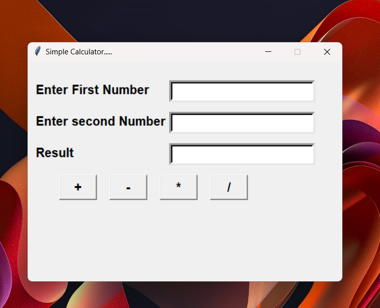

#Calculator

Calculator is an engaging Python-based GUI application crafted using fundamental Python concepts and the Tkinter library. The application combines visual appeal with interactive functionality, demonstrating the use of basic GUI development concepts and Python logic.

##Features

Python and Tkinter Integration: The application leverages Python for core functionality and Tkinter for creating the graphical user interface, resulting in an aesthetically pleasing and functional calculator.
GUI Development: The project showcases the use of Tkinter widgets and layout management to create an intuitive user interface for the calculator.
Event-Driven Programming: Explore the implementation of event handlers in Python, managing user interactions such as button clicks for number input and arithmetic operations.
Dynamic Value Manipulation: Experience how Python handles dynamic value manipulation, such as updating the display when numbers are entered or calculations are performed.
Interactive Functionality: Witness how Python and Tkinter work together to create a responsive and engaging user experience in a practical application.

##Contributing

If you're interested in contributing to the Calculator project, feel free to fork the repository and submit pull requests. Your contributions are highly welcome!

##License

Calculator is licensed under the MIT License, making it open for collaboration and reuse.

##Acknowledgements

Special thanks to the Python and Tkinter development communities for inspiration and support.
Feel free to customize this README further based on your project's specific details and requirements. This structure provides a comprehensive overview of your Calculator application, making it more accessible to others who may explore your GitHub repository.
