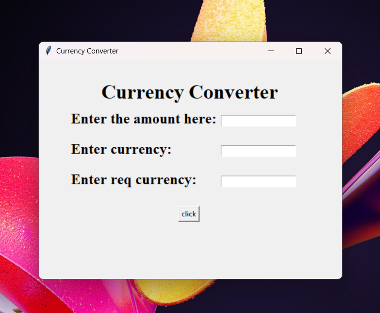

#Currency Converter

Currency Converter is a user-friendly Python-based GUI application developed using the Tkinter library. This application allows users to convert amounts from one currency to another by specifying the source and target currencies. It combines a visually appealing design with interactive functionality, showcasing the use of fundamental GUI development concepts and Python logic.

##Features

Python and Tkinter Integration: The application utilizes Python for its core functionality and Tkinter to create the graphical user interface, resulting in a simple yet effective currency converter.

User-Friendly Interface: The project features an intuitive and easy-to-navigate interface using Tkinter widgets and layout management, making the conversion process straightforward for users.

Dynamic Currency Selection: Users can select both the source currency (the currency they want to convert from) and the target currency (the currency they want to convert to) using dropdown menus.

Real-Time Conversion: The application allows users to enter the amount they wish to convert, and upon selecting the currencies and submitting, it instantly displays the converted amount based on the current exchange rates.

Event-Driven Programming: The application employs event handlers in Python to manage user interactions, such as currency selection, input validation, and conversion calculations.

Data Validation: Ensures that users enter valid numeric values for the amount and selects different currencies for conversion to avoid errors.

##Contributing

If you're interested in contributing to the Currency Converter project, feel free to fork the repository and submit pull requests. Contributions are welcome, whether you're fixing bugs, adding new features, or improving documentation.

##License

Currency converter is licensed under the MIT License, making it open for collaboration and reuse.

##Acknowledgements

Special thanks to the Python and Tkinter development communities for their inspiration and support. This project also uses exchange rate data from online APIs to ensure accurate and up-to-date currency conversion.
